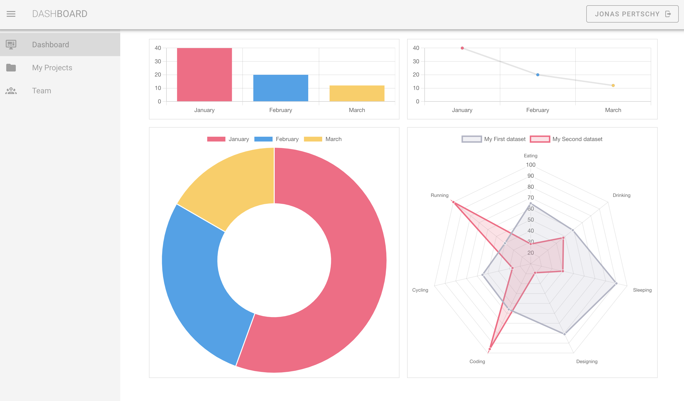

# Vuetify 2 dashboard foundation

> A Vuetify 2 dashboard foundation. Free to use and modify. No attribution required. Clean and simple. This is the dashboard I was searching for. It's not overloaded and easy to customize.



## Background

I've been using Vuetify 2 for a while now and I've been building a lot of dashboards. I've been using the same basic layout and structure for each one. I decided to make a template that I can use for future projects. I'm releasing it here for anyone who might find it useful.

## Why Vuetify 2?

Vuetify is a great design framework for building modern web applications. It's lightweight, easy to use, and has a lot of great components. I've been using it for a while now and I'm very happy with it. The material design spec is timeless and it's a great starting point for any web application.

## Why not Vuetify 3?
Vue 3 is still in beta and Vuetify 3 is still in alpha. I'm not ready to use it in production yet. I wasted a lot of time trying to get Vuetify 3 to work. I'm sticking with Vuetify 2 for now and recommend you do the same.

## Recommended development environment

I recommend using [Visual Studio Code](https://code.visualstudio.com/) with the [Vetur](https://marketplace.visualstudio.com/items?itemName=octref.vetur) extension. It's a great IDE for Vue.js development.

## Project setup
```
npm install
```

### Compiles and hot-reloads for development
```
npm run serve
```

### Compiles and minifies for production
```
npm run build
```

### Lints and fixes files
```
npm run lint
```

### Customize configuration
See [Configuration Reference](https://cli.vuejs.org/config/).
